# Stephcraft
✦ 10yr Dev Experience — *🧠 Outperforming LLMs*
 
 UGC/Game Development × 
 Web/Apps Development × 
 Libraries/Tooling

## Projects
- 🧟 [Zombiecraft](https://v2.zombiecraft.net) — *A Next generation Zombie survival Minecraft Server*
-    [InFrame](https://inframe.stephcraft.net) — *Generate custom frames for your LinkedIn profile*

  

    More...
  

- 🎮 [SUO](https://stephcraft.itch.io/suo) — *1yr gamedev project*
- 🎮 [Void](https://stephcraft.itch.io/void) — *Top 50 of Community Game Jam*
- 🎮 [C# Dungeon](https://www.youtube.com/watch?v=_7BpjnLQnsw) — *Made with Windows Form*

## GitHub

  

      Private Repositories
  

 

>  **Active**

###  ZombiecraftProject/Zombiecraft
A Next generation Zombie survival Minecraft Server   · [zombiecraft.net](https://v2.zombiecraft.net)

###  ZombiecraftProject/ResourcePack-Tool
A CLI Tool to build Minecraft resource packs   · *LOCKED-IN*

###  ZombiecraftProject/ServerSetup-Tool
A CLI Tool to setup Minecraft servers   · *LOCKED-IN*

 

>  **Stale**

###  ZombiecraftProject/Marketing-Tool
A Marketing Tool for gamedev projects and beyond   · *LOCKED-IN*

###  Stephcraft/InFrame
Make custom LinkedIn frames, made with Next.js   · [inframe.stephcraft.net](https://inframe.stephcraft.net)

###  Stephcraft/Music
A CLI Tool to download Music    · *TODO*

###  Stephcraft/Virtualization
An actually good web virtualization library   · [Reddit Post](https://www.reddit.com/r/reactjs/comments/1fb9poc/need_help_with_table_virtualization_for_large)

 

  

    More...
  

 

>  **Inactive** · *Not to say that these won't get remastered one day!*

<!--
# Private Archived Repositories
> Not to say that these won't get remastered one day!
-->

###  Stephcraft/Stephcraft.net
Website made with vanilla HTML, CSS and JS   · [stephcraft.net](https://stephcraft.net) (2019)

###  Stephcraft/CS-Dungeon
A Dungeon game made with C# Windows Form   · [YouTube video](https://www.youtube.com/watch?v=_7BpjnLQnsw) (2019)

###  Stephcraft/Void
Community Game Jam Project made with Unity   · [stephcraft.itch.io/void](https://stephcraft.itch.io/void) (2019)

###  Stephcraft/Horror-Game-Prototype
A pixel-art low-poly game made with Three.js   · [stephcraft.itch.io/horror-game-prototype](https://stephcraft.itch.io/horror-game-prototype) (2017)

###  Stephcraft/Processing-Sketches
A collection of prototype Processing sketches   · *Unreleased* (2016)

## Contact
<!--  -->

## About Me

  

    About
  

 

- 💻 Microsoft Surface Laptop · 7th Edition — Snapdragon X Elite · 32 RAM · 1 TB SSD
- 📍 Montreal → Ottawa

### 🛠️ Tech Stack
- **Languages** →  Kotlin ·  Typescript
- **IDE** →  IntelliJ ·  VS Code
- **Web** →  Next.js ·  Supabase

### 🕹️ Favorite Games

#### Sandbox

#### Valve

#### Masterpiece

### ❛❛ Quotes
 — ❝*Everything is impossible until somebody does it*❞  
 — ❝*Hack → Build things worth hacking*❞  

### 💬 Socials
[![Planet Minecraft](https://img.shields.io/static/v1?style=flat&label=Planet+Minecraft&logo=data:image/png;base64,iVBORw0KGgoAAAANSUhEUgAAACAAAAAfCAYAAACGVs+MAAAAAXNSR0IB2cksfwAAAAlwSFlzAAALEwAACxMBAJqcGAAAB8lJREFUeJyNV2tsXEcV/mbm3n17vbt2nHjrJE2iBKsFRElJLaAIzEOUWPCHlIpAW4kfIFQUWgmpoqDwB5B/U0IjJAT8CKgkKkQJBUXQlECRUdR3ohQlzbOJY3vX+977nOHMvXfXa3sdPNbqXs/MnvOd13fOGljnGt337MgcG35ZgQFMRbvBS+cfeirFlFQfLczvPfPcgevrkWusF4BizFBwxw3zAszYm2jLnVDuZsDbSKccjFcwJP6Kgl3DBrktsV65fQFMfHVwm698Qxt4i30WbSGQHjxUHBU5ODyOMbwGl/8Ht+Xn4DQfAZOCACbhGuNwxSks+DO7Jh4dSpGH4LYkoefIxTa++7ffnauvC4DL2//04RVDyxeQYbeRwTXsfvAuLLSeRHF0K/KxF2DxtzA/93NwLwOblTBfy8PzDuDtmedODKnfIMmuwo3ClWCJL9DjxTUBPPSN9wufOcOSVNZxTXByq4JEkc/oqMNPChhGCQnzCixrEooA2K3Pg/npIAk4LyFmnIX07iEw90OZfwInAMJlgQdseLn7940UGEkbEEPVv//+vL8MQMm+ssVn9muURXz8IZYBRZxzupzVnswTLBdcMEhjD1mcpeiYZG0RtscDAMp/H9LmLvoAW+59AAUvh2SQl1q6xPz5xV+6tm9zRoZAfIQ2310GwIPHJLwBSmROpoIbkgAkCPkUXPc+pOPHCPstSLUBjrcHs+Uz8FUWvWXAGAuenBuwxWeglSXUabrg0ZmXVkymdV6QZ/kdc8AwBYRBQeA5FMRPyPICcgP/hSkGsCF5AeduTsAjiwksAdLqWRiGUH/wXse30MIXMYzv0P575MFL0ZmCL/07J2E+n4URAzJiEE/fl0PCyNDu4TBBpYPvnTmCa6X9pN9Eywu/o01Kmh0JKvjz1ChmcQwpnKSQPU5gUxSMGHm7e3EJgGJLADouBevZ7C5GnqnANN+Aa+0Gi6xfe9EpMwLFc+pTaLIdxBeLtP/bEMDI/l89QTIyjcLxwpahk4yYjBQsuXWVOJ3R3jgMcYMs2d1Lg+Sd8D2RiEPK8MT1JHw2iWbuCRjxOjYnn0e2bD82ui87p6vDWHCTz1AkN6XZZYx+wA/UcnEHgxgBsD6NdssMlYdYg4cThTadSkVgFVqWDSUHYeW+BjNzGWPpoygtVH7g+YLCJqMQ8BaysopYzAzoXSeWBuJJG5eqryDG0/RepMTbTFYSAIfD9UMLTbE6TJ5cCqPv+1BdpJENOiosdJeBKIrCYMgXssGm7TqhIK+Mw+cfCd5nK4fRam0mcAaabsdwhUIqaE/LVrnNAqXaAzZ5QBukQ8J7L7GQogMPKJmBD90/GssEqQi1ViDd7SQw1vF494R1LvTKXuWTtVdUBZJ4PRGgXp34HNXWx9FwRikEHWA9EBXDymyNCy2RPnIJUo46pYFzFBOrHwCBmtpGDHcFgthE+oziOEwKx4hEKphdfAZtd6yvBapPqSQiqb6MDKJLBX4cccyQt1lU86oXACl1d9LzpeCg1vowblUOUQJtRCp+ihK/RPs6L2J9Qay5esGx8MPYcsRG55by88FTJ0wsPoBULEGeoKQUE9QBz0GwFnW+kMEc2UlCFmT8ylVpWtA0QMMRIjrAnPdNDJslpPnFsAyUCBB2PRB4QSXpzMNA5hWkk1OoN/ejZk0hJhwkEy+AeSOw7Alwp0CNiAVx9vuEoGn75H4VVIGKYtTwP4YMvxdpcTEMAVUAYz4RmnR+TMoz7eb2oT/++ehTBn+PT37i2xDiClXKIVRrX6Kan6QGtYBcepbYT9LAEjYAgzziR57WihptN9j3PA1Ahnv1ekhI89dxG3ehnUpQnjkHSfltDcRwjz72bBCCh49sbVy+ekBDe3PsBNKJN1Ac/C4GzH2YbU8To+2hmq8jzl9HPKYzIgPPfgCdzqrrvN52Qkr2vECpJBCNZjN4WqXrqFs7UIp9BUnx1pHqsbMXoxzoJIxLLtF1zqkadlG13A3L+xCyyT8gl/o1laGFwcFpuhPytK6Qsn+QZoXxKJ7/b2m3G/DdewhykXCe7SRhtJwaKY8HF8ulMiWfoOzfCDv/NA0j/0LSmEFr7gI1qk4lvIOUoj35QXJ3gd5rqLKvo+ZMYnGxQlaHpKG6daoC9mMqSWPtElctAfDdLgvZVps8S1MRp3aRy6NhT1JcN2FY/JRi3uyxqkr8ScNGUA/UWNiDgbsdp0H3VzJaVIfd9xUATM+qcuZPK8YNu3z1ABVIUo9YC9ZCMGrpYXRTsT/JBlVFXdKwTyPrNjBfJda0lxOXaJdOcNe+KJguPbuyCkD7L9/Xmz/U73LqZ49KxoKZsnkrLPR0cg7NRNgtadrHKv7VRtDkM6hehD1/ELZtR+g0aAJXmz3k/mM6GMtv9Hyn70imLVaRp6J2Q+Qzindav6CzBrYnfwSTlbuzwLLvokPPRm/Xok6bx1wfXf2HUuXspWzXtMc6gzWV/t1zV2PPkyi0xOOIs5sYEcdJQDtQJKkSSvKTlJQ7YfrOlz1lzy/NeYoIyH+7r65+m9aJp15fuZfYO12xmmG5lbGDPLEVkma7Aj8NTuzpoIAb7hSpMpFF5d/uySdv9n7/cj9FawHot0Zpor9Ev/O64wdZPO/tpexiVB2n0PKJD/SPVKqGHcMmXl2n3P8B3IWBLM5zDGIAAAAASUVORK5CYII=&logoColor=ffffff&color=478be5&labelColor=3b7bd5&message=Stephcraft)](https://www.planetminecraft.com/member/stephcraft)
[![Spigot Forum](https://img.shields.io/static/v1?style=flat&label=Spigot&logo=data:image/png;base64,iVBORw0KGgoAAAANSUhEUgAAACUAAAAgCAYAAACVU7GwAAAAAXNSR0IB2cksfwAAAAlwSFlzAAALEwAACxMBAJqcGAAACFtJREFUeJytl2tsVMcVx8/Mfe3dtddr1mvM0wYEi2jUEjAllEd4CNI0MklUUNOqype2NKqqfiFKEAEhkfhDpVCoSqKmjZS0UtJCU0qRRUUfoPKIkIAawiPUvOqlGNvY4Mfu3ufM9My9u3Rt1o7TeuXxzN2dx+/+z8w5ZwiM46f307dSn17ruL9sfTP7f+Yhn3dA7uKPXtQiiR8C0F4gtAeIdl8QrQe83kWE55uEEmsFJfERAZ4Swk0R4aewTw3n/vno3Ne/yzkX4w1F+s6+uCNaUb0jHIrzC4F/PtYeEKIAqAngbi9QLY6/U+yG/agBvs9O1yzYszSfz/Nxh7rx5+eeiZnqt/B9Hc7B5kI4vs+dZM3EF8xo5XTPc/rvdtx5V1ORhYBOCNEpBd1n/FLDmoN7UKlxh4J4PK5Go1EtFovJtsCCSgnyhx/XHtE0c7kAevvtfbcXfnw1NmjbNrEsC7LZLOi6zpqbm721a9eOr/nk4q7roil8gosApZRggQMHDihfbfjtEc2oWCnAyBxrZY8/9e1fDMgxcg9JcbCfkH0hsLm0KhkRbsxQEqhkzJD2qVOn6AJzz2FNN1cLGsucvBJZuGrD7oEiQKF+pD0S2JigCkDDoR4+X7hwgc7230AobZUgFbf/kZm+6ImvbesrgSiFGQJYDuwzoUYBCkpnZydJPnh9l+DORuB2Ck9aHpSqAzaZsiWe3tw7AtCoYKNClTGZLLT0+fjx4+qSyp9cwy0zEZQ4ED0Fwuny7/QnF01b+tM2QshoUBzKmHIsUCMCyXLu3DlzHmm+ToWTIPrEAIq791iXNXP51MatF+UGHwOUGBNUGaDhUDSTySiTB7YfJuAtQQdKkQidvI6DuZygK0fTa+LztmbKQZR7LoKNBWoISLGWv/dffmOZ4V/9gIr8BAIMCHpzUKI42AfCBoSjzHjJSDfvU1W1FKAUZHg7MGNZqFHM9rBGf0Vzn7z0mkH6XqGKArgwKAqqpERCpdggMGEey6Ve/UZV7Vx3GERp/YhaY4EqBXrYdhyH9p587mVTs7apqgboDkBDMKpgFxoNugrvQX5AXfrlxGNb74wCM6T+LKjhZhsOpdw91rTZVPOvaSoBQ6cga1XDfWXWY48IiPxN5x5bsKR2wc52XGw4SFmwslB957dq0cpEDb5tVq3/gYWdhsBgyKCe51GM9kr3iY2bo1puq6FRiBgUDI2gYibQ2AzsrYGw/uX2wfx1iS/uvFQCNRpcaEIJ4rVtSwPVE5btUZ698ZUqM7+D01iLYy7erhkxIWilQ2qff5DL5SgGVwWDrJLtbq0we375a532PxkpQEVQLcPAmBhtwL0Vw4l7ZGZzRxjT9vp1m97TK2c5w0DKqSXIU0smKH/6+bKrmAtNcV1MGLml6irXQK328KEP31gwUpmzPXLUdnzDcmmf7UKO2fdWELfrCU3hxNDJf6F03PBmHQD6rGAdlpNzMkGjZ4U+7X0WX96iJFf3of8aGer6HxsbZtXX3gK9FhwrB6roBUU1Q2tJy2lJ4J4FTq4LbNcH2/bA9Th4LEyLVOyiazTYU0UTKngCSQTBtETB8rgWy4aFRh2hVPyG6fU/o/UvXynADYXqPLJ4xcSk/ncpt+N6oEfrkAUzNLcbJ8AjrlYBZwxcNw+ObYFtZUGmL4yFDphisqkrmM1JlRBORyjMaLCoKHIVgk0IfVcRjlvh3KD2OErDOn3erssFpzkE6pmJSa1FoCI2JmSRqlkQxCvrRqCSwHjGfQt8tKxrD4KT7wXPtRGKBzMoCKAimCaBUDbZVhCSkhAOPSquX4EdUgU4/I7j1rLbcbx25q65aeXkdFPRjxXMd7Dx6VlTI4dlbm07LhhmNc6D5nM6cLJq4LQClUJl3EHAVBfBsli7IPN/3MSBhVWE0BQS1LIEUDQEDj9FOMzbMTbKcATOvwH8ATboxleajb8/XfD60k9xcuStLzSuW1x9JkjuGQF5chWtEt/GDX0WOkKfK+DmuwUm/4Izn/qYSXIWvpZcVlGKioVAYQ2BWqTAFfYl4ZbAtTDNCdbwmLYPEsveRiE6H/izr9emN3KyZnE8dWjXY+dVlVb7fmB0mYPrPlct28724OshlMqOn8++yXxmpxIwZ3KSNEUMSJNw3QBIGaJU4TssckI8re0dPXBoxiT4Hjr86MOQK28/6GTlNkEls65jfd9YsP9DzLHBWL8i+SX0xlUM0+lvrkstblqRfCXT5X20dNONnXgxcCdPmsya1j9rpdNpaGtr065d+TixfHbH8vQ09nxVjKRNg9TgCTRk+FMpemRKHMFJb94hl2506geP/7PuzOpFyZmNUy+/h9C1AYhUS0JJxfzBIIgzMD5RG//2eNHoWuF48HkzovF5M6PTbE/prZvT1LllyxaOYDSZTMrkP8wO+vvp2bNntaNHj0Zv3bppTjAHK2oT3KwwiaLrKnN4LH8vP6l/esMsZ/78+W6avvNkTUXud8DyanjIpMZauLfkJ3AXlmzxvfs7UuViXxDvVq1aJVpaWgBNOWKShyGHYMghMjijm5DPwcmVN51IJCLk5sWbD/ScePbpKdW5/eHsanBhDbKJohkllD8gfWDvhlevzv1f0uFSuOG/PTKFvGIdfOeFSesX3r2I7iIaKISnOtjwgTYe+G7Ou93Rd+L9Qx17dr6b+ctYLw7lwB651ZQbLv/t3btX+/qcD3fXTVC+E6Q0CORx3RrIk5t3e1jrydaev+7+1dXT129nZYqT+zxXrHJgACOr9HB4e3s7vLl9w6R1C931ubzPWtvszAdH+jL9g24Wg/sAYzJAQjFYj8tltFwdDCmt8cJKUDGlu7sbowHjeGYY3hf5/fv3H7n3/Qc+tiFHJY8ToQAAAABJRU5ErkJggg==&logoColor=ffffff&color=e29247&labelColor=df8734&message=Stephcraft)](https://www.spigotmc.org/members/stephcraft.987253)

<!--
**Stephcraft/Stephcraft** is a ✨ _special_ ✨ repository because its `README.md` (this file) appears on your GitHub profile.

Here are some ideas to get you started:

- 🔭 I’m currently working on ...
- 🌱 I’m currently learning ...
- 👯 I’m looking to collaborate on ...
- 🤔 I’m looking for help with ...
- 💬 Ask me about ...
- 📫 How to reach me: ...
- 😄 Pronouns: ...
- ⚡ Fun fact: ...

 
-->
